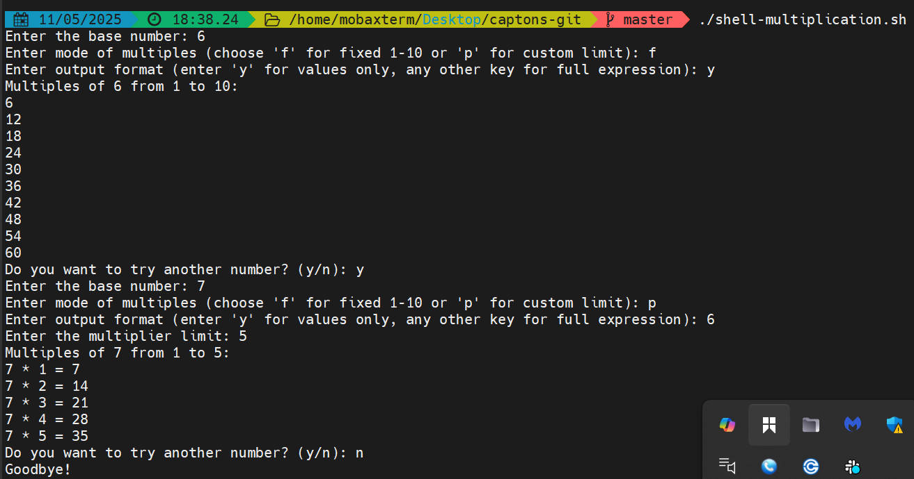

# shell-capstone
### 📝 **Usefulness and Functionality of the Bash Multiples Script**

---

### ✅ **Usefulness of the Code:**

1. **Educational Tool for Learning Multiplication:**

   * The script is great for helping students or beginners **practice multiplication tables**.
   * It gives users the flexibility to generate a fixed or custom range of multiples.

2. **Flexible Output Options:**

   * Users can choose **just the values** (e.g., `6`) or **detailed expressions** (e.g., `2 * 3 = 6`).
   * This makes it useful both for **quick reference** and **educational clarity**.

3. **User-Friendly Interaction:**

   * Prompts and validation make it interactive and hard to break, even for non-technical users.
   * It guides users through each step with clear instructions and helpful messages.

4. **Reusable and Efficient:**

   * Users can repeat the process as many times as they like without restarting the script.
   * Great for quick checks or multiple use cases in one session.

5. **Scripting Practice:**

   * This script demonstrates key Bash scripting concepts: loops, conditionals, user input, validation, and formatting.
   * A useful example for beginners learning shell scripting.

---

### ⚙️ **How It Works (Functionality Breakdown):**

1. **Starts a `while true` loop** to allow repeated execution until the user quits.

2. **Prompts the user for:**

   * A **base number** (e.g., 5)
   * A **mode**:

     * `f`: Fixed multiples from 1 to 10
     * `p`: Custom number of multiples
   * An **output format** option:

     * `y`: Show only values (e.g., `10`)
     * Otherwise: Show full math (e.g., `5 * 2 = 10`)

3. **Validates inputs** to ensure the base and limits are **positive integers**.

4. **Uses loops (`for`)** to calculate and display:

   * `base * 1`, `base * 2`, ..., up to the specified limit

5. **Asks if the user wants to try again**, and either repeats or exits the script.

---

### 🧠 Example Use Case:

```bash
Enter the base number: 4
Enter mode of multiples (choose 'f' for fixed 1-10 or 'p' for custom limit): p
Enter output format (enter 'y' for values only, any other key for full expression): n
Enter the multiplier limit: 3
Multiples of 4 from 1 to 3:
4 * 1 = 4
4 * 2 = 8
4 * 3 = 12
Do you want to try another number? (y/n): n
Goodbye!
```
## my capstone code below


```
#!/bin/bash

while true; do
  # Prompt for base number
  read -p "Enter the base number: " base

  # Input validation for base number
  if ! [[ "$base" =~ ^[0-9]+$ ]]; then
    echo "Input must be a positive integer."
    continue
  fi

  # Prompt for mode
  read -p "Enter mode of multiples (choose 'f' for fixed 1-10 or 'p' for custom limit): " mode

  # Ask for output format once
  read -p "Enter output format (enter 'y' for values only, any other key for full expression): " format

  if [[ "$mode" == "f" ]]; then
    echo "Multiples of $base from 1 to 10:"
    for ((i=1; i<=10; i++)); do
      if [[ "$format" == "y" || "$format" == "Y" ]]; then
        echo "$((base * i))"
      else
        echo "$base * $i = $((base * i))"
      fi
    done

  elif [[ "$mode" == "p" ]]; then
    read -p "Enter the multiplier limit: " limit
    if ! [[ "$limit" =~ ^[0-9]+$ ]]; then
      echo "Multiplier limit must be a positive integer."
      continue
    fi

    echo "Multiples of $base from 1 to $limit:"
    for ((i=1; i<=limit; i++)); do
      if [[ "$format" == "y" || "$format" == "Y" ]]; then
        echo "$((base * i))"
      else
        echo "$base * $i = $((base * i))"
      fi
    done

  else
    echo "Invalid mode entered. Please choose 'f' or 'p'."
    continue
  fi

  # Ask if the user wants to repeat
  read -p "Do you want to try another number? (y/n): " choice
  if [[ "$choice" != "y" && "$choice" != "Y" ]]; then
    echo "Goodbye!"
    break
  fi

done


```



